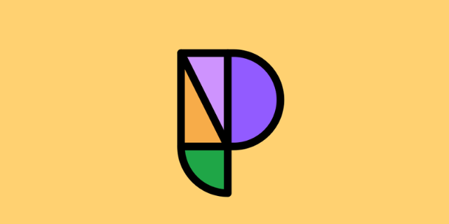

<p align="center">
  
</p>

# Phosphor Icons for Flutter

🇺🇸 [Read this document in English](README.md)

[](https://pub.dev/packages/phosphoricons_flutter)
[](LICENSE)
[](https://dart.dev)
[](#)

> **⚠️ Pacote Não-Oficial da Comunidade**  
> Este é um pacote Flutter não-oficial e mantido pela comunidade. Ele não é afiliado ou endossado pelos criadores originais do Phosphor Icons. Todos os recursos visuais de ícones são propriedade dos seus respectivos criadores.

Uma biblioteca completa de ícones para Flutter baseada no [Phosphor Icons](https://phosphoricons.com) — **Mais de 1530 ícones** em **6 estilos de peso**, totalmente compatível com **Dart 3.x**.

> **Por que um novo pacote?**  
> O pacote original `phosphor_flutter` utiliza `class PhosphorIconData extends IconData`, o que quebra no Dart 3.x porque `IconData` se tornou uma `final class` (classe final). Este pacote corrige isso desde a base e se mantém sincronizado com o núcleo oficial do Phosphor Icons.

---

## Funcionalidades

- **1530+ ícones** do [Phosphor Icons](https://phosphoricons.com) v2.1
- **6 estilos de peso** — Thin, Light, Regular, Bold, Fill, Duotone
- **Compatível com Dart 3.x** — sem o uso de `extends IconData` em nenhum lugar
- **Suporte a Duotone** via widget `PhosphorIcon` (Stack de duas camadas com opacidade e cor configuráveis)
- **Sombras** — `PhosphorIcon(..., shadows: [...])`, em todos os estilos (inclusive Duotone)
- **Dois padrões de acesso** — classes por estilo ou atalhos em uma única classe
- **Todos os aliases (apelidos) de ícones** incluídos (ex: `asclepius` e `caduceus` compartilham o mesmo codepoint)
- **Otimizado para Tree-shaking** — todas as classes são anotadas com `@staticIconProvider`
- **Fácil substituição para código existente** — o padrão `PhosphorIconsRegular.xxx` funciona como antes

---

## Instalação

Adicione ao seu `pubspec.yaml`:

```yaml
dependencies:
  phosphoricons_flutter: ^1.1.0
```

Em seguida, execute:

```bash
flutter pub get
```

---

## Como usar

### 1. Estilos planos — Thin, Light, Regular, Bold, Fill

Use com o widget nativo `Icon` do Flutter. Todas as constantes são puramente `IconData`.

```dart
import 'package:phosphoricons_flutter/phosphoricons_flutter.dart';

// Classe separada por estilo (explícita e otimizada para tree-shaking)
Icon(PhosphorIconsRegular.storefront, size: 32)
Icon(PhosphorIconsBold.storefront, size: 32)
Icon(PhosphorIconsThin.storefront, size: 32)
Icon(PhosphorIconsLight.storefront, size: 32)
Icon(PhosphorIconsFill.storefront, size: 32, color: Colors.deepPurple)
```

### 2. PhosphorIcons — atalhos em uma única classe

Acesse qualquer ícone e estilo através de uma única classe com sufixos no nome:

```dart
Icon(PhosphorIcons.storefront)          // Regular (padrão)
Icon(PhosphorIcons.storefrontBold)      // Bold
Icon(PhosphorIcons.storefrontFill)      // Fill
Icon(PhosphorIcons.storefrontThin)      // Thin
Icon(PhosphorIcons.storefrontLight)     // Light
PhosphorIcon(PhosphorIcons.storefrontDuotone)  // Duotone
```

### 3. Widget PhosphorIcon

`PhosphorIcon` é um substituto direto para o widget `Icon` do Flutter e gerencia automaticamente ícones planos e Duotone:

```dart
PhosphorIcon(PhosphorIconsRegular.house)
PhosphorIcon(PhosphorIconsBold.heart, color: Colors.red, size: 32)
PhosphorIcon(PhosphorIconsFill.rocketLaunch, color: Colors.deepPurple)
```

Adicione uma sombra com `shadows`, exatamente como no `Icon`:

```dart
PhosphorIcon(
  PhosphorIconsBold.heart,
  color: Colors.red,
  size: 48,
  shadows: [Shadow(color: Colors.black38, blurRadius: 6, offset: Offset(0, 4))],
)
```

### 4. Duotone

Ícones Duotone exigem o `PhosphorIcon` porque eles renderizam duas camadas de fonte empilhadas via o widget `Stack`.

```dart
// Básico — camada secundária na opacidade padrão (0.20)
PhosphorIcon(PhosphorIconsDuotone.storefront)

// Cor e opacidade personalizadas
PhosphorIcon(
  PhosphorIconsDuotone.storefront,
  size: 48,
  color: Colors.indigo,
  duotoneSecondaryOpacity: 0.30,
)

// Cor secundária personalizada (a camada de preenchimento recebe um tom diferente)
PhosphorIcon(
  PhosphorIconsDuotone.rocketLaunch,
  color: Colors.white,
  duotoneSecondaryColor: Colors.deepPurple,
  duotoneSecondaryOpacity: 0.40,
)
```

### 5. Encontrando os nomes dos ícones

Todos os ícones usam camelCase. Encontre qualquer ícone em [phosphoricons.com](https://phosphoricons.com) e converta:

| Nome no Phosphor | Constante Dart |
|---|---|
| `storefront` | `PhosphorIconsRegular.storefront` |
| `rocket-launch` | `PhosphorIconsRegular.rocketLaunch` |
| `graduation-cap` | `PhosphorIconsRegular.graduationCap` |
| `chart-bar` | `PhosphorIconsRegular.chartBar` |
| `magnifying-glass` | `PhosphorIconsRegular.magnifyingGlass` |

---

## Referência da API

### PhosphorIcon

| Propriedade | Tipo | Padrão | Descrição |
|---|---|---|---|
| `icon` | `Object` | obrigatório | `IconData` ou `PhosphorDuotoneIconData` |
| `size` | `double?` | `null` | Tamanho em pixels lógicos (herda de `IconTheme`) |
| `color` | `Color?` | `null` | Cor do ícone (herda de `IconTheme`) |
| `shadows` | `List<Shadow>?` | `null` | Sombras pintadas atrás do ícone (herda de `IconTheme`). No Duotone valem para as duas camadas |
| `fill`, `weight`, `grade`, `opticalSize` | `double?` | `null` | Aceitos por compatibilidade com o `phosphor_flutter` e o `Icon`. Sem efeito visual: as fontes Phosphor são estáticas (use outro estilo, como `PhosphorIconsBold`, para mudar a espessura) |
| `duotoneSecondaryOpacity` | `double` | `0.20` | Opacidade da camada de preenchimento de fundo (apenas Duotone) |
| `duotoneSecondaryColor` | `Color?` | `null` | Cor da camada de preenchimento — o padrão é `color` |
| `semanticLabel` | `String?` | `null` | Rótulo de acessibilidade |
| `textDirection` | `TextDirection?` | `null` | Substituição da direção do texto |

### Classes de Ícones

| Classe | Estilo |
|---|---|
| `PhosphorIconsRegular` | Peso Regular |
| `PhosphorIconsThin` | Peso Thin |
| `PhosphorIconsLight` | Peso Light |
| `PhosphorIconsBold` | Peso Bold |
| `PhosphorIconsFill` | Estilo Filled (Preenchido) |
| `PhosphorIconsDuotone` | Duotone (use com `PhosphorIcon`) |
| `PhosphorIcons` | Atalho — todos os estilos via sufixo de nome |

### Tipos

| Tipo | Descrição |
|---|---|
| `PhosphorIconData` | Alias (Apelido) para `IconData` (retrocompatibilidade) |
| `PhosphorDuotoneIconData` | Contém dois `IconData` (preenchimento primário + traços secundários) |
| `PhosphorIconsStyle` | Enum: `thin`, `light`, `regular`, `bold`, `fill`, `duotone` |

---

## Compatibilidade com Dart 3.x

O pacote original `phosphor_flutter` estendia `IconData`:

```dart
// phosphor_flutter — quebra no Dart 3.x
class PhosphorIconData extends IconData { ... }
```

O Dart 3.x transformou `IconData` em uma `final class` (classe final), então estendê-la fora do `dart:ui` causa um erro de compilação. Este pacote corrige isso:

```dart
// phosphoricons_flutter — Compatível com Dart 3.x
typedef PhosphorIconData = IconData;  // alias, sem herança
```

`PhosphorDuotoneIconData` é uma classe independente (sem herdar de `IconData`) e é tratada de forma transparente pelo widget `PhosphorIcon` através de um `Stack`.

---

## Migrando do phosphor_flutter (v2.x)

Se você está migrando um projeto existente do pacote descontinuado `phosphor_flutter`, por favor, note as seguintes quebras de compatibilidade:

### 1. Atualize as Importações
Substitua todas as importações do pacote antigo pelo novo:
* **Buscar:** `import 'package:phosphor_flutter/phosphor_flutter.dart';`
* **Substituir por:** `import 'package:phosphoricons_flutter/phosphoricons_flutter.dart';`

*Dica: Você pode usar a ferramenta global "Find & Replace" (Buscar e Substituir) da sua IDE (VS Code, Android Studio, IntelliJ) para atualizar todos os arquivos de uma vez.*

### 2. Ícones Duotone e Incompatibilidade de Tipos
No pacote original `phosphor_flutter`, os ícones Duotone (como `PhosphorIconsDuotone.whatsappLogo`) eram subtipos de `IconData`. No `phosphoricons_flutter`, devido às exigências do Dart 3.x, os ícones Duotone agora utilizam `PhosphorDuotoneIconData` (que **não** herda de `IconData`).

* **Uso de Widgets**: Você deve renderizar ícones Duotone usando o widget `PhosphorIcon`. O widget `Icon` padrão do Flutter não aceitará mais ícones Duotone.
  ```dart
  // ❌ Não irá compilar
  Icon(PhosphorIconsDuotone.bell)

  // ✅ Irá compilar e renderizar corretamente
  PhosphorIcon(PhosphorIconsDuotone.bell)
  ```

* **Componentes Personalizados e Tipos de Variáveis**: Se você passa ícones Duotone para widgets personalizados ou os armazena em variáveis tipadas como `IconData?`, você deve mudar seus tipos para `Object?` ou `dynamic`:
  ```dart
  // ❌ Irá falhar ao passar um ícone Duotone
  class MyButton extends StatelessWidget {
    final IconData? icon;
    const MyButton({this.icon});
    
    @override
    Widget build(BuildContext context) {
      return Icon(icon);
    }
  }

  // ✅ Use Object? e PhosphorIcon
  class MyButton extends StatelessWidget {
    final Object? icon; // Aceita tanto IconData quanto PhosphorDuotoneIconData
    const MyButton({this.icon});
    
    @override
    Widget build(BuildContext context) {
      return PhosphorIcon(icon);
    }
  }
  ```

### 3. `shadows` e outros parâmetros do `Icon`
O `PhosphorIcon` voltou a aceitar `shadows` (e `fill`, `weight`, `grade` e `opticalSize`, que não têm efeito visual nas fontes Phosphor estáticas), então o código que passava esses parâmetros ao `PhosphorIcon` antigo compila sem alterações.

---

## Atualizando ícones

As fontes incluídas são do Phosphor Icons **v2.1.x** (idênticas às publicadas no pacote npm [`@phosphor-icons/web`](https://www.npmjs.com/package/@phosphor-icons/web)). Quando o Phosphor Icons lançar novos ícones:

1. Baixe o ZIP de fontes mais recente de [phosphoricons.com](https://phosphoricons.com) → **Download** → **Fonts** (ou use as pastas `src/<estilo>/` do pacote npm `@phosphor-icons/web`, que traz os mesmos `selection.json` e TTFs)
2. Extraia e substitua o conteúdo de `phosphor-icons/Fonts/` na raiz do repositório
3. Execute o gerador:

```bash
cd tool
dart pub get
dart generate.dart
```

O gerador lê cada `selection.json`, copia os arquivos TTF para `lib/fonts/`, e regenera todos os 7 arquivos fonte do Dart automaticamente.

---

## Contribuindo

Contribuições são bem-vindas! Por favor, abra uma issue ou pull request no [GitHub](https://github.com/lucaszafret/phosphoricons_flutter).

Se você encontrar um ícone faltando ou nomeado incorretamente, é muito provável que seja um problema de dados no lançamento oficial do Phosphor — verifique o [phosphor-icons/core](https://github.com/phosphor-icons/core) primeiro, depois abra uma issue aqui.

---

## Licença

Este pacote é lançado sob a [Licença MIT](LICENSE).

Os arquivos de fonte do Phosphor Icons em `lib/fonts/` também são licenciados sob a MIT pelo [Phosphor Icons](https://github.com/phosphor-icons/core).
